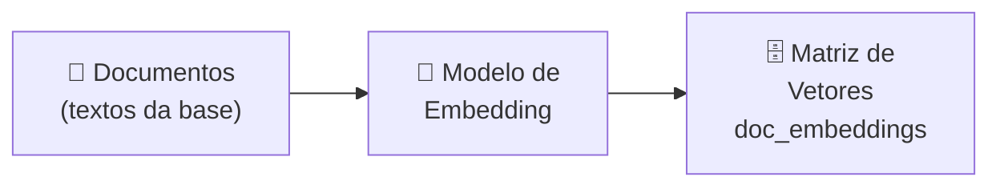
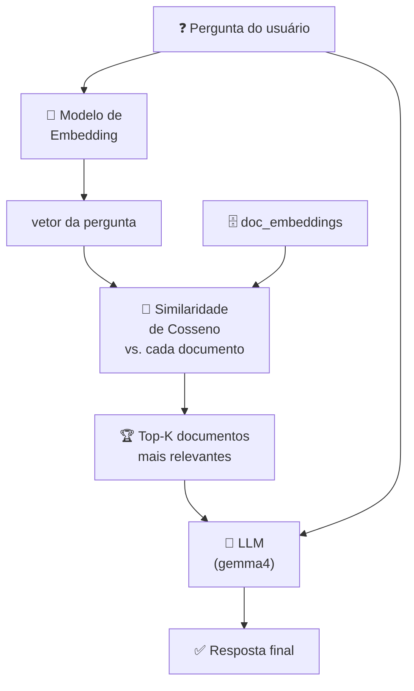
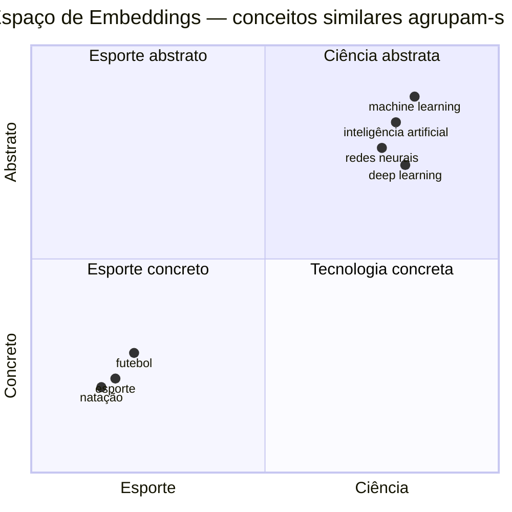
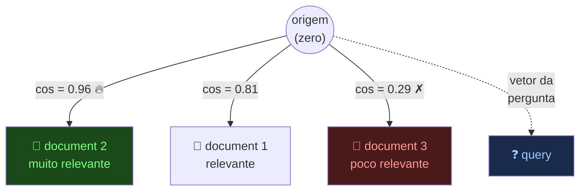
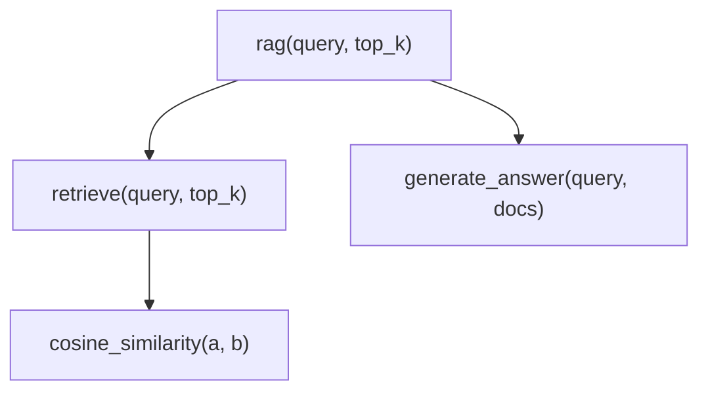

# Naive RAG — do Zero em Python

> **Objetivo deste documento:** ensinar RAG e Python ao mesmo tempo, do ambiente ao código, sem precisar de nenhuma fonte externa.

---

## Sumário

1. [O que é RAG?](#1-o-que-é-rag)
2. [Como o pipeline funciona?](#2-como-o-pipeline-funciona)
3. [O que são Embeddings?](#3-o-que-são-embeddings)
4. [O que é Similaridade de Cosseno?](#4-o-que-é-similaridade-de-cosseno)
5. [Instalação passo a passo com uv](#5-instalação-passo-a-passo-com-uv)
6. [Configuração do Ollama e dos modelos](#6-configuração-do-ollama-e-dos-modelos)
7. [Guia do código linha a linha](#7-guia-do-código-linha-a-linha)
8. [Como executar](#8-como-executar)
9. [Glossário](#9-glossário)

---

## 1. O que é RAG?

**RAG** = *Retrieval-Augmented Generation* (Geração com Recuperação Aumentada).

Um LLM (modelo de linguagem) treinado sozinho tem dois problemas:

| Problema | Exemplo |
|----------|---------|
| **Conhecimento congelado** | Não sabe o que aconteceu após o treino |
| **Alucinação** | Inventa respostas plausíveis mas erradas |

O RAG resolve isso dando ao modelo uma **base de conhecimento consultável** em tempo real. Em vez de depender apenas do que "memorizou", ele primeiro **busca** os trechos mais relevantes e só então **gera** a resposta fundamentado neles.

```
Sem RAG:   Pergunta ──► LLM ──► Resposta (pode alucinar)

Com RAG:   Pergunta ──► Busca na base ──► LLM + Contexto ──► Resposta fundamentada
```

---

## 2. Como o pipeline funciona?

O RAG tem duas fases distintas:

### Fase 1 — Indexação (feita uma vez, antes de qualquer pergunta)



> Cada documento é convertido em um vetor numérico e armazenado. Isso é feito uma única vez.

### Fase 2 — Consulta (feita a cada pergunta)



**Resumindo em 3 verbos:**
1. **Encode** — converte texto em vetor
2. **Retrieve** — encontra os vetores mais próximos
3. **Generate** — usa o contexto para responder

---

## 3. O que são Embeddings?

Um **embedding** é uma representação numérica do significado de um texto.

Imagine que cada texto vira um ponto no espaço. Textos com significados parecidos ficam próximos. Textos diferentes ficam distantes.



Na prática, embeddings têm centenas ou milhares de dimensões (não apenas 2), mas a ideia é a mesma: **proximidade no espaço = similaridade de significado**.

### Como o Ollama gera embeddings?

```python
resposta = ollama.embeddings(model="embeddinggemma:latest", prompt="machine learning")
# resposta é um dicionário como:
# { "embedding": [0.023, -0.415, 0.887, 0.102, ...] }  ← lista com centenas de números
vetor = resposta["embedding"]
```

O modelo lê o texto e produz um vetor onde cada número captura algum aspecto semântico.

---

## 4. O que é Similaridade de Cosseno?

Para comparar dois textos, comparamos seus vetores. A métrica usada é a **similaridade de cosseno**.

### A fórmula

```
                  A · B
cos(θ) = ─────────────────────
           ‖A‖ × ‖B‖
```

Onde:
- `A · B` = **produto escalar**: multiplica os elementos na mesma posição e soma tudo
- `‖A‖` = **norma** (comprimento) do vetor A: raiz quadrada da soma dos quadrados

### Interpretação geométrica

| | **θ ≈ 0° — Similares** | **θ = 90° — Ortogonais** | **θ ≈ 180° — Opostos** |
|---|:---:|:---:|:---:|
| **Vetores** | ↑ ↗ (quase paralelos) | ↑ e → (em cruz) | ← e → (opostos) |
| **cos(θ)** | → **1** | → **0** | → **−1** |
| **Significado** | Mesma direção semântica | Sem relação alguma | Sentidos contrários |
| **Exemplo** | "cão" e "cachorro" | "futebol" e "algoritmo" | "amor" e "ódio" |

> **Por que cosseno e não distância euclidiana?**
> O cosseno mede o **ângulo** entre vetores, não o comprimento. Um texto curto e um longo sobre o mesmo assunto têm o mesmo ângulo, mas comprimentos diferentes. O cosseno os reconhece como similares corretamente.

### Exemplo numérico passo a passo

```python
import numpy as np

v1 = np.array([1, 2, 3])
v2 = np.array([4, 5, 6])

# Passo 1: produto escalar
# (1×4) + (2×5) + (3×6) = 4 + 10 + 18 = 32
dot_product = np.dot(v1, v2)
# dot_product = 32

# Passo 2: normas (comprimentos)
# ‖v1‖ = √(1² + 2² + 3²) = √14 ≈ 3.742
# ‖v2‖ = √(4² + 5² + 6²) = √77 ≈ 8.775
norm_v1 = np.linalg.norm(v1)   # ≈ 3.742
norm_v2 = np.linalg.norm(v2)   # ≈ 8.775

# Passo 3: similaridade
# 32 / (3.742 × 8.775) = 32 / 32.83 ≈ 0.974
similaridade = dot_product / (norm_v1 * norm_v2)
# similaridade ≈ 0.974  ← muito similares!
```

### Documentos como vetores no espaço



> Cada seta saindo da origem é um vetor. O ângulo entre o vetor da **query** e o de cada **document** determina a relevância — ângulo menor = `cos` maior = mais relevante. É exatamente isso que o `retrieve()` calcula.

---

## 5. Instalação passo a passo com uv

### O que é o uv?

`uv` é um gerenciador de pacotes e ambientes Python extremamente rápido (escrito em Rust). Substitui `pip` + `venv` com uma ferramenta unificada.

### Por que usar uv ao invés de pip?

| | `pip` + `venv` | `uv` |
|--|--|--|
| Velocidade | lento | 10-100x mais rápido |
| Gerenciamento de Python | manual | automático |
| Lock file | não nativo | automático |
| Ambientes | manual | integrado |

### Passo 1 — Instalar o uv

```bash
# Linux / macOS
curl -LsSf https://astral.sh/uv/install.sh | sh

# Ou com pip (se já tiver Python)
pip install uv
```

Após instalar, feche e abra o terminal para o `uv` entrar no PATH.

```bash
# Verificar se funcionou
uv --version
# uv 0.9.12 (ou superior)
```

### Passo 2 — Clonar o projeto

```bash
git clone <url-do-repositório>
cd naive-rag
```

### Passo 3 — Criar o ambiente virtual e instalar dependências

```bash
# Cria o .venv e instala tudo listado no pyproject.toml (incluindo ipykernel para Jupyter)
uv sync --dev
```

> **O que acontece aqui?**
> - `uv sync` lê o `pyproject.toml`
> - Cria um ambiente virtual em `.venv/`
> - Instala todas as dependências automaticamente
> - `--dev` inclui as dependências de desenvolvimento (como `ipykernel`)

### Passo 4 — Ativar o ambiente virtual

```bash
# Linux / macOS
source .venv/bin/activate

# Windows (PowerShell)
.venv\Scripts\Activate.ps1

# Windows (CMD)
.venv\Scripts\activate.bat
```

Após ativar, o terminal mostrará `(naive-rag)` no início do prompt.

### Estrutura do pyproject.toml explicada

```toml
[project]
name = "naive-rag"
version = "0.1.0"
requires-python = ">=3.12"      # versão mínima do Python

dependencies = [
    "numpy>=2.4.4",             # vetores e álgebra linear
    "ollama>=0.6.1",            # cliente para modelos locais via Ollama
    "sentence-transformers>=5.3.0",  # modelos de embedding alternativos
    "groq>=0.32.0",             # cliente para API Groq (alternativa de LLM)
]

[dependency-groups]
dev = [
    "ipykernel>=7.2.0",         # permite rodar Jupyter Notebooks no VS Code
]
```

### Comandos uv úteis

```bash
# Adicionar uma nova dependência
uv add requests

# Remover uma dependência
uv remove requests

# Atualizar todas as dependências
uv sync --upgrade

# Ver o que está instalado
uv pip list

# Rodar um script sem ativar o ambiente manualmente
uv run python rag.py
```

---

## 6. Configuração do Ollama e dos modelos

### O que é o Ollama?

O Ollama é um servidor local que roda modelos de linguagem no seu próprio computador. Sem internet, sem custo por token.

### Instalar o Ollama

```bash
# Linux
curl -fsSL https://ollama.com/install.sh | sh

# macOS
brew install ollama
```

### Iniciar o servidor

```bash
ollama serve
# Deixe rodando em um terminal separado
# O servidor fica em http://localhost:11434
```

### Baixar os modelos usados no projeto

```bash
# Modelo de embeddings (converte texto em vetores)
ollama pull embeddinggemma:latest

# Modelo de texto (gera a resposta final)
ollama pull gemma4:e2b
```

> **Diferença entre os dois modelos:**
> - `embeddinggemma` — só converte texto em números. Não "conversa". É rápido e leve.
> - `gemma4:e2b` — modelo de linguagem completo. Lê o contexto e gera texto fluente.

### Verificar se os modelos estão disponíveis

```bash
ollama list
# Deve mostrar embeddinggemma:latest e gemma4:e2b na lista
```

---

## 7. Guia do código linha a linha

### Visão geral das funções



### `cosine_similarity(a, b)`

```python
def cosine_similarity(a, b):
    return np.dot(a, b) / (np.linalg.norm(a) * np.linalg.norm(b))
```

| Parte | O que faz |
|-------|-----------|
| `np.dot(a, b)` | Produto escalar: `a[0]*b[0] + a[1]*b[1] + ... + a[n]*b[n]` |
| `np.linalg.norm(a)` | Comprimento do vetor a: `√(a[0]² + a[1]² + ...)` |
| divisão | Normaliza para [-1, 1] |
| resultado `1.0` | Textos idênticos |
| resultado `0.0` | Textos sem relação |
| resultado `-1.0` | Textos com sentidos opostos |

### `retrieve(query, top_k=3)`

```python
def retrieve(query, top_k=3):
    # 1. Converte a pergunta em vetor
    query_embedding = ollama.embeddings(model=EMBED_MODEL, prompt=query)["embedding"]

    # 2. Compara com cada documento
    similarities = []
    for i, doc_emb in enumerate(doc_embeddings):
        sim = cosine_similarity(query_embedding, doc_emb)
        similarities.append((i, sim))

    # 3. Ordena do mais relevante para o menos
    similarities.sort(key=lambda x: x[1], reverse=True)

    # 4. Retorna os top_k melhores
    return [(documents[i], sim) for i, sim in similarities[:top_k]]
```

**Python — conceitos usados:**

```python
# enumerate: retorna índice + valor ao iterar
for i, valor in enumerate(["a", "b", "c"]):
    print(i, valor)
# 0 a
# 1 b
# 2 c

# lambda: função anônima de uma linha
# key=lambda x: x[1] significa "ordene usando o segundo elemento da tupla"
pares = [(0, 0.9), (1, 0.4), (2, 0.7)]
pares.sort(key=lambda x: x[1], reverse=True)
# [(0, 0.9), (2, 0.7), (1, 0.4)]

# list comprehension com fatiamento
top3 = [(documents[i], sim) for i, sim in pares[:3]]
# pega os 3 primeiros e monta uma nova lista de tuplas (documento, score)
```

### `generate_answer(query, retrieve_docs)`

```python
def generate_answer(query, retrieve_docs):
    # 1. Junta os documentos em um bloco de texto
    context = "\n".join([doc for doc, _ in retrieve_docs])

    # 2. Chama o LLM com o contexto
    response = ollama.chat(
        model=TEXT_MODEL,
        messages=[
            {"role": "system", "content": "Use apenas o contexto fornecido..."},
            {"role": "user",   "content": f"Context:\n{context}\n\nPergunta: {query}"},
        ],
    )

    # 3. Extrai o texto da resposta
    return response["message"]["content"]
```

**O papel do `role` nas mensagens:**

```
system  →  Instrução de comportamento para o modelo
           ("Você é um especialista, use apenas o contexto...")

user    →  O que o usuário enviou
           (contexto recuperado + a pergunta)

assistant → O que o modelo respondeu (gerado automaticamente)
```

**Python — conceitos usados:**

```python
# "_" como nome de variável: convenção para "não me importo com esse valor"
for doc, _ in retrieve_docs:
    # _ seria o score de similaridade, que aqui ignoramos
    print(doc)

# "\n".join(lista): une elementos com quebra de linha entre eles
"\n".join(["linha 1", "linha 2", "linha 3"])
# "linha 1\nlinha 2\nlinha 3"

# f-string: insere variáveis em strings com {}
nome = "Python"
print(f"Olá, {nome}!")  # "Olá, Python!"
```

### `rag(query, top_k=3)` — a orquestradora

```python
def rag(query, top_k=3):
    retrieved = retrieve(query, top_k)         # etapa 1: buscar
    answer = generate_answer(query, retrieved)  # etapa 2: gerar
    return answer, retrieved                    # retorna os dois para debug
```

Esta função é o **ponto de entrada**. Ela conecta as duas etapas e retorna tanto a resposta quanto os documentos usados — assim você pode auditar de onde a resposta veio.

---

## 8. Como executar

### Opção A — Jupyter Notebook no VS Code

1. Abra `rag.ipynb` no VS Code
2. No canto superior direito, clique em **Select Kernel**
3. Escolha **Python Environments** → selecione `.venv`
4. Execute célula por célula com `Shift+Enter`

### Opção B — Script Python direto

```bash
# Com o ambiente ativado
uv run python rag.py

# Ou ativando manualmente
source .venv/bin/activate
python rag.py
```

### O que esperar na saída

```
# print(answer) vai mostrar algo como:
Machine learning é um campo da inteligência artificial que permite que
sistemas aprendam padrões a partir de dados, melhorando seu desempenho
sem serem explicitamente programados...

# print(docs) vai mostrar a lista de tuplas (documento, score):
[
  ("Machine learning é um campo da IA...", 0.923),
  ("O objetivo é criar modelos capazes...", 0.871),
  ("Aplicações de ML vão desde...", 0.812),
]

# O loop formata os scores:
 - 0.923: Machine learning é um campo da IA...
 - 0.871: O objetivo é criar modelos capazes...
 - 0.812: Aplicações de ML vão desde...
```

---

## 9. Glossário

| Termo | Definição |
|-------|-----------|
| **RAG** | Retrieval-Augmented Generation — pipeline que recupera contexto antes de gerar |
| **LLM** | Large Language Model — modelo de linguagem grande (ex: Gemma, GPT) |
| **Embedding** | Vetor numérico que representa o significado de um texto |
| **Similaridade de cosseno** | Medida de similaridade baseada no ângulo entre dois vetores |
| **Produto escalar** | Soma dos produtos elemento a elemento de dois vetores |
| **Norma** | Comprimento/magnitude de um vetor |
| **Top-K** | Os K resultados com maior score |
| **Contexto** | Trecho de texto passado ao LLM para fundamentar a resposta |
| **Alucinação** | Quando o LLM inventa informações sem base real |
| **uv** | Gerenciador de pacotes Python moderno e rápido |
| **Ollama** | Servidor para rodar LLMs localmente |
| **pyproject.toml** | Arquivo de configuração do projeto Python (dependências, versão, etc.) |
| **venv / .venv** | Ambiente virtual: cópia isolada do Python com as dependências do projeto |
| **f-string** | String com interpolação de variáveis Python usando `f"texto {variavel}"` |
| **list comprehension** | Forma compacta de criar listas: `[expr for item in lista]` |
| **enumerate** | Função Python que retorna índice + valor ao iterar uma lista |
| **lambda** | Função anônima de uma linha em Python |
